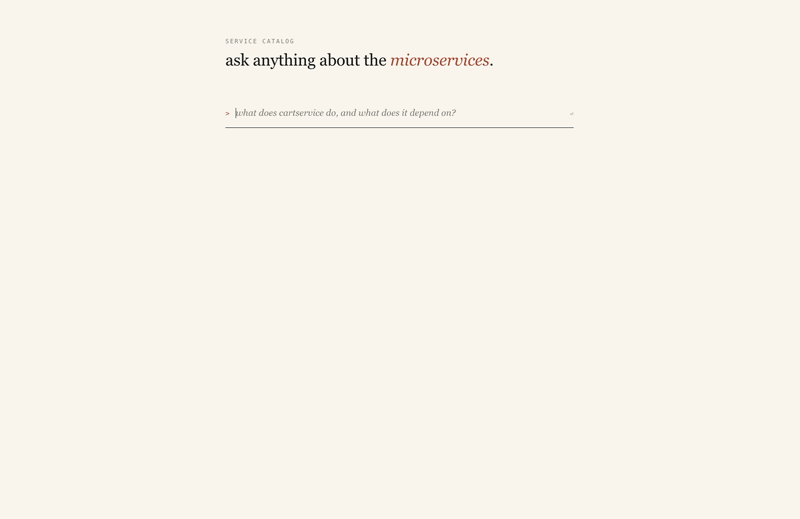
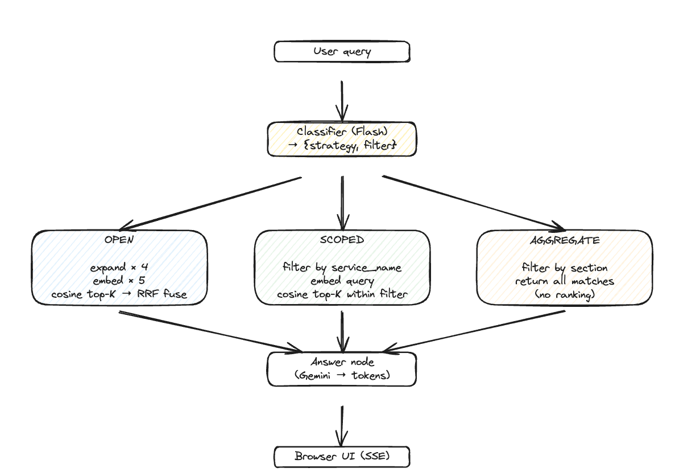

# Service Discovery

RAG over a polyglot microservices repo (12 services across Go, Python, Java,
C#, Node). Ask natural-language questions about the codebase, get cited
answers, streamed live in the browser.

Built over Google Cloud's
[microservices-demo](https://github.com/GoogleCloudPlatform/microservices-demo).



## Stack

- Gemini 3 Flash Preview for generation, Gemini Embedding 001 (768d) for retrieval
- LangGraph for the routing graph
- FastAPI + Server-Sent Events for streaming
- Vanilla HTML/JS frontend, no build step
- RAGAS for evals


## How it works



A Flash call classifies the query and emits `{strategy, filter}`. LangGraph
routes to one of three retrieval paths based on the strategy. All three feed
into a shared answer node that streams tokens to the UI.

## Design decisions

### Indexing

The source files for each service were messy: Dockerfile, README, proto,
source across five languages. Embedding them directly would mean tons of
vectors with very inconsistent shape. So the first pass is an LLM that
compresses each service into one Markdown summary with a uniform structure
(overview, APIs, dependencies, etc). The corpus is now 12 clean docs instead
of 1,000+ mixed files. This can be acheved in many ways, but using coding agent like 
codex made the most sence to be context aware.

Chunks split on H2 headers. Each section in a summary answers a different
kind of question, so the section boundary is also a natural retrieval
boundary.

Each chunk gets `[<service> · <section>]` prepended at embed time. Only at
embed time, the stored text stays clean for display. The prefix anchors the
vector to its source: "Adds an item to cart" and "Adds an item to order"
embed differently because the prefix names different services. Costs nothing.

Embedding model: `gemini-embedding-001` at 768d (Matryoshka, so smaller is
fine at this corpus size). Docs go in with `task_type=RETRIEVAL_DOCUMENT`,
queries go in with `RETRIEVAL_QUERY`. The same model gives different vectors
depending on which side of the search the text is on.

For this project, I used JSON file as index store which is then loaded onto memory at runtime.
However, a proper vector DB would be more appropriate in production.

Per-chunk metadata: `service_name`, `section`, `chunk_index`, `source_path`.
The first two are what the router filters on.

### Querying

The user's query gets expanded into 4 independent paraphrases / sub questions before retrieval
to increase relevant document match and broaded recall.

The 5 ranked lists (original + 4 expansions) fuse via Reciprocal Rank Fusion
with `k=60`.

However, I realized that not every question fits this approach.
For example, "List all microservices", "How many services are there?" needs
every service, but top-K only returns 5, so 7 services would silently
disappear from the answer. So, I realised top-k isn't the right tool for all quesitons.
Hence the router. A Flash classifier picks one
of three strategies:

- **open**: multi-query + RRF over the whole corpus
- **scoped**: metadata filter narrows the corpus, then top-K within
- **aggregate**: pure filter, no ranking, return everything that matches

### Evaluation

Eval uses RAGAS with 4 metrics, split between retrieval and generation:

- **Context precision / recall** for retrieval
- **Faithfulness / answer relevancy** for generation

The first eval run didn't score well. Per-row analysis showed three distinct
failure modes:

1. **Aggregate queries collapsed entirely.** "List all services", "every
   gRPC API", etc. scored 0.00 precision / 0.00 recall. Top-K returns 5 of
   12 services, so the answer is silently incomplete. Top-K was clearly the
   wrong tool for "list all" questions.
2. **Drift from wrong-direction chunks.** "What does cartservice do and
   what does it talk to" pulled in a chunk about *checkoutservice* talking
   to cartservice. The model didn't hallucinate, but the answer drifted off
   the question because a wrong-direction chunk was in context.
3. **Recall miss on broad questions.** "What is the role of the frontend
   service" missed the `language_framework` chunk, so the reference's
   "written in Go" claim was unsupported in retrieval.

The router was built directly in response. The aggregate route bypasses
ranking and uses a metadata filter to return every matching chunk, fixing
the "list all" collapse. The scoped route filters on `service_name` first
so chunks about *other* services never enter the candidate pool, fixing
the drift case.

After implementing the router, scores improved across the board. The
aggregate queries that had been scoring zero went up substantially once
retrieval was no longer capped at 5 chunks for "list all" questions.

## Repo layout

```
core/        rag.py, pipeline.py  (primitives + LangGraph)
server.py    FastAPI for UI
static/      simple html UI
indexing/    summarize.py, build_index.py  (scripts to prep documents)
eval/        eval.py + evalset.json
summaries/   per-service Markdown corpus
```

## Run it

```fish
# 1. Auth + env
gcloud auth application-default login                # only if using GENAI_BACKEND=vertex
cp .env.example .env  # fill in GEMINI_API_KEY (https://aistudio.google.com/apikey)
uv sync

# 2. Clone the demo microservices repo
mkdir -p data && git clone --depth 1 \
    https://github.com/GoogleCloudPlatform/microservices-demo \
    data/microservices-demo

# 3. Build the corpus
uv run python indexing/summarize.py data/microservices-demo
uv run python indexing/build_index.py

# 4. Serve the web UI
uv run uvicorn server:app --port 8080
# → open http://localhost:8080

# RAGAS eval over evalset.json
uv run python eval/eval.py
```
